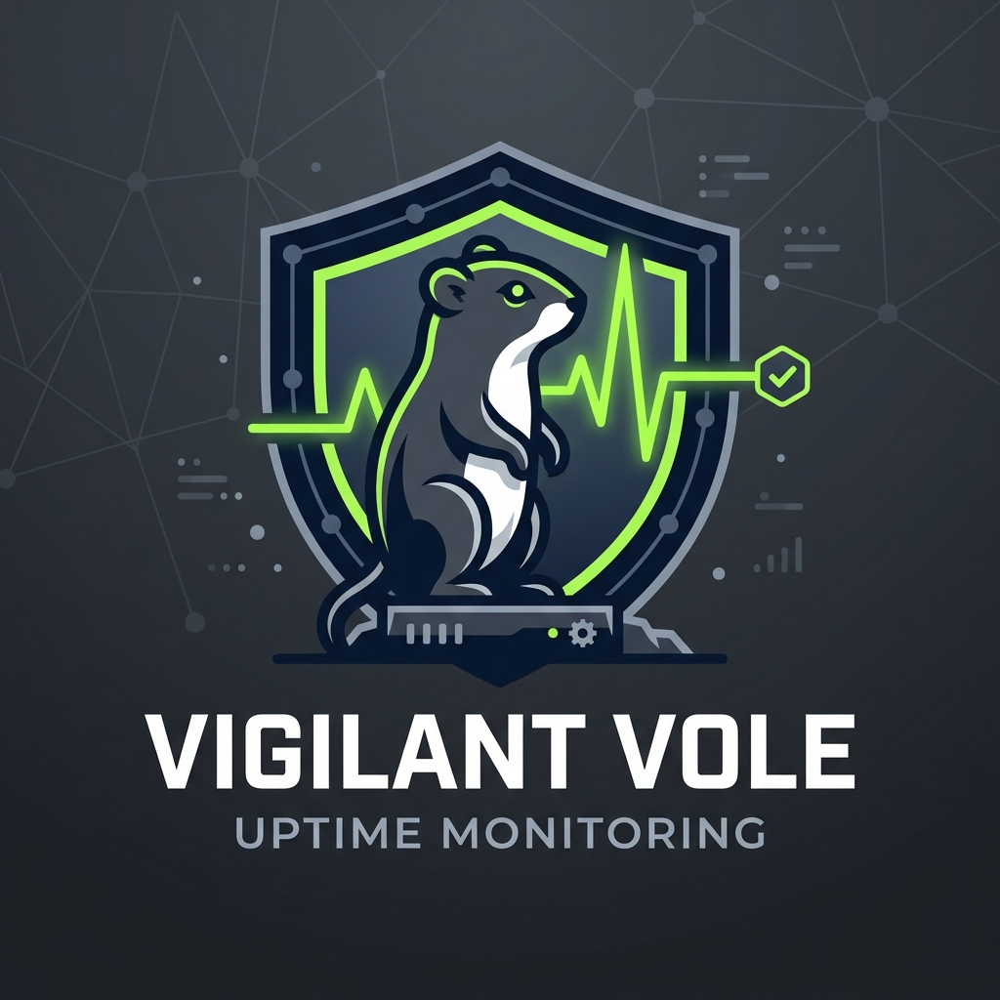
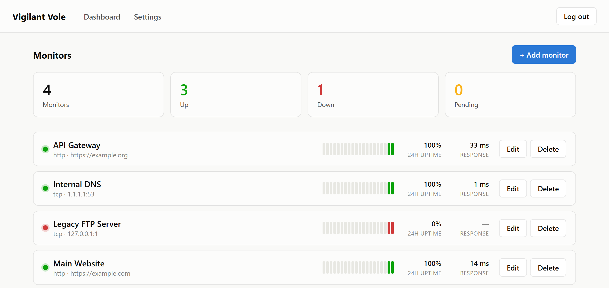

<div align="center">



# Vigilant Vole

**A lightweight, self-hosted uptime monitor built in Rust.**
Single binary. Single Docker container. One volume. Inspired by [Uptime Kuma](https://github.com/louislam/uptime-kuma), built for a smaller footprint.

[](LICENSE)
[](https://www.rust-lang.org/)
[](#-quick-start)
[](#-unraid)



</div>

## Contents

- [Features](#-features)
- [Why Rust instead of Node.js](#-why-rust-instead-of-nodejs)
- [Quick start](#-quick-start)
- [Unraid](#-unraid)
- [Configuration](#-configuration)
- [Notifications](#-notifications)
- [Building from source](#-building-from-source)
- [Architecture](#-architecture)
- [Roadmap](#-roadmap)
- [License](#-license)

## ✨ Features

- **Monitor types** — HTTP(S) (status code + timeout), TCP port, and ICMP Ping
- **Live dashboard** — status, response time, a 20-point heartbeat sparkline, and 24h uptime % per monitor, all pushed to the browser over Server-Sent Events. No polling, no manual refresh.
- **Configurable checks** — per-monitor interval, timeout, and a retry count before a flaky check is actually marked "down"
- **Notifications** — Discord (rich embeds), Slack, Telegram, and generic webhooks, fired once on every settled up ↔ down transition
- **Authentication** — a first-run setup wizard creates a single admin account; every route is session-gated behind it
- **Dark mode** — follows your OS preference automatically, no toggle needed
- **Responsive** — usable dashboard from a phone, not just a desktop monitor
- **One volume** — the SQLite database and session key both live under a single `/data` mount; back it up by copying one folder

## 🦀 Why Rust instead of Node.js

Uptime Kuma runs on Node.js. Vigilant Vole deliberately doesn't, because the priority here is the smallest, fastest thing that can run unattended on a NAS:

| | Vigilant Vole | Typical Node.js stack |
|---|---|---|
| Runtime | none — one static binary | Node.js + `node_modules` |
| Frontend | server-rendered HTML ([Askama](https://askama.readthedocs.io/) + [HTMX](https://htmx.org/)) | separate SPA build (Vite/webpack) |
| Database driver | SQLite compiled *into* the binary (`rusqlite` bundled) | native module / separate process |
| Docker image | **~23 MB** | typically 150MB+ |
| Idle memory | a few MB | tens of MB |

There's no Node.js stage in the Docker build at all — templates are compiled in at build time and static assets (HTMX, CSS) are embedded directly into the binary via `rust-embed`.

## 🚀 Quick start

Requires Docker. Clone the repo, then:

```bash
git clone https://github.com/Ferdinand99/Vigilant-Vole.git
cd Vigilant-Vole
docker compose up -d
```

Open **http://localhost:3001** — you'll land on a one-time setup wizard to create the admin account, then the dashboard.

`docker-compose.yml`:

```yaml
services:
  vigilant-vole:
    build: .
    image: vigilant-vole:latest
    container_name: vigilant-vole
    restart: unless-stopped
    ports:
      - "3001:3001"
    volumes:
      - ./data:/data
    environment:
      - DATA_DIR=/data
    cap_add:
      - NET_RAW # required for ICMP ping monitors
```

Everything persistent — the SQLite database and the signed-cookie session key — lives under `./data`. Deleting that folder resets the app to a blank slate.

## 🐳 Unraid

1. Add the container (via the Docker tab, or a Community Applications template pointing at this repo's `Dockerfile`)
2. Map a port: container `3001` → any host port
3. Map a path: container `/data` → `/mnt/user/appdata/vigilant-vole`
4. Add `NET_RAW` under **Extra Parameters**: `--cap-add=NET_RAW` (only needed if you use Ping monitors)
5. Start the container and open the WebUI

Backup and restore are just copying `/mnt/user/appdata/vigilant-vole` — there's nothing else to snapshot.

## 🔧 Configuration

Two environment variables, both optional:

| Variable | Default | Description |
|---|---|---|
| `DATA_DIR` | `./data` | Where the SQLite database and session key are stored |
| `PORT` | `3001` | Port the server listens on inside the container |

Everything else (monitors, notification channels, the admin account) is configured through the web UI — there's no separate config file.

## 🔔 Notifications

Under **Settings → Notification channels**, add one or more of:

| Channel | What it needs |
|---|---|
| **Discord** | a webhook URL — posts a color-coded rich embed (green/yellow/red) with the monitor, status, and error |
| **Slack** | a webhook URL |
| **Telegram** | a bot token + chat ID |
| **Generic webhook** | any URL — posts `{"monitor", "status", "message"}` as JSON |

Notifications fire once per settled transition (up → down or down → up) — a monitor sitting in its retry grace period never spams a channel.

## 🔨 Building from source

No local Rust install required — everything can be built inside Docker:

```bash
docker build -t vigilant-vole:latest .
```

For local development with `cargo` installed (Rust 1.98+):

```bash
cargo run
```

The server reads `templates/` and `static/` at **compile time** (they're embedded into the binary), so a fresh `cargo build` is needed after editing either.

## 🧩 Architecture

```
src/
├── main.rs           # entrypoint: config, DB, scheduler, router, serve
├── config.rs         # env var config loading
├── db/               # SQLite access layer (rusqlite + deadpool-sqlite)
├── api/              # Axum HTTP handlers (dashboard, monitors, auth, SSE, notifications)
├── auth/             # argon2 password hashing + signed-cookie sessions
├── monitor/          # the check scheduler + HTTP/TCP/Ping checkers
└── notification/     # Discord/Slack/Telegram/webhook senders
templates/            # Askama HTML templates (compiled in)
static/               # htmx.min.js, the SSE extension, and style.css (embedded in)
migrations/           # SQL schema, embedded and run on startup
```

A single `Scheduler` spawns one `tokio` task per active monitor. Each tick runs the appropriate checker, records a heartbeat, and broadcasts an update signal that the `/events` SSE endpoint picks up to push a fresh dashboard fragment to every connected browser.

## 🧭 Roadmap

Deliberately out of scope for now, to keep the first release tight:

- [ ] Public status pages
- [ ] Maintenance windows
- [ ] TLS certificate expiry checks
- [ ] Push/heartbeat-style monitors
- [ ] Multi-user / roles
- [ ] Tags & monitor grouping
- [ ] Monitor pause/resume

## 📄 License

[MIT](LICENSE) © [Ferdinand99](https://github.com/Ferdinand99)
